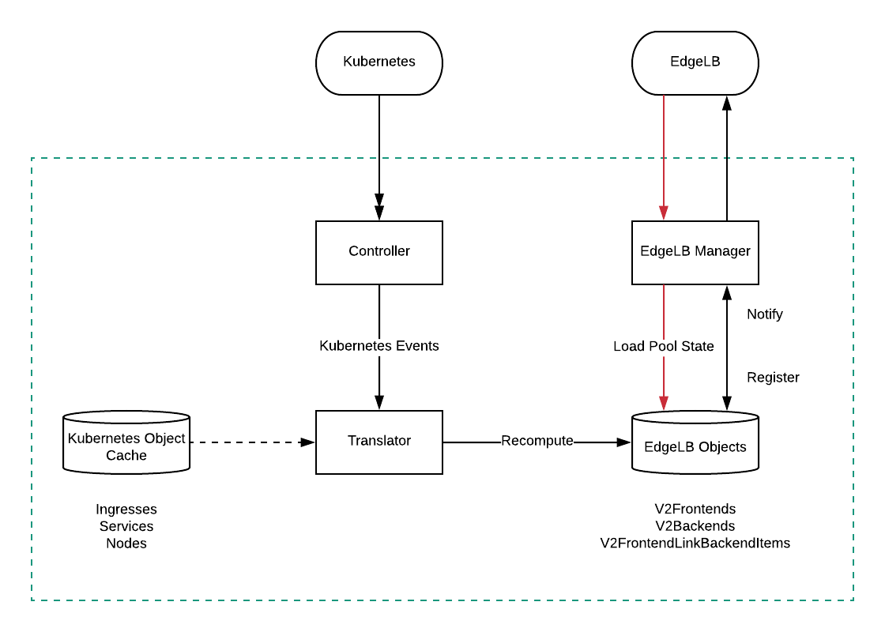

:sectnums:
:numbered:
:toc: macro
:toc-title:
:toclevels: 3
:numbered!:
ifdef::env-github[]
:tip-caption: :bulb:
:note-caption: :information_source:
:important-caption: :heavy_exclamation_mark:
:caution-caption: :fire:
:warning-caption: :warning:
endif::[]

= `dklb`: TCP/HTTP Load-Balancing
:icons: font

[discrete]
== Table of Contents
toc::[]

== Overview

Exposing services or web apps in a highly-available manner is complex.
It requires advanced knowledge on concepts such as routing, firewalling, proxying and load-balancing.

The purpose of this document is to lay out the requirements and design for a solution that integrates https://docs.mesosphere.com/services/edge-lb/[EdgeLB] and DC/OS Kubernetes in order to provide first-class support for TCP and HTTP load-balancing (both internal and external to the DC/OS cluster).

== Background

Below is the mandatory background for anyone engaging in this design document.

=== Kubernetes Service

A https://kubernetes.io/docs/concepts/services-networking/service/[Service] is a logical entity that groups pods based on certain https://kubernetes.io/docs/concepts/overview/working-with-objects/labels/[selectors] in a loosely-coupled fashion.
Any intra-Kubernetes cluster application can declare a service to expose itself or rely on another service(s) to resolve and access other applications in the same Kubernetes cluster.

There are a few https://kubernetes.io/docs/concepts/services-networking/service/#publishing-services---service-types[types of Service].
For the scope of this document, and particularly for the goals of this effort, this design only cares about the https://kubernetes.io/docs/concepts/services-networking/service/#loadbalancer[`LoadBalancer`] type.

A service of type `LoadBalancer` is inherently also a service of types `ClusterIP` and https://kubernetes.io/docs/concepts/services-networking/service/#nodeport[`NodePort`], meaning that Kubernetes will automatically assign it an IP drawn from the service CIDR, as well as make it accessible on a "high" port in each Kubernetes node (the default range for these ports being `30000`-`32767`).
To observe this, one can create a simple deployment and create a `Service` resource of type `LoadBalancer` targeting it:

[source,console]
----
$ kubectl create deployment --image=nginx:latest nginx
deployment.apps/nginx created
$ kubectl expose deployment nginx --port=80 --target-port=80 --name=nginx-lb --type=LoadBalancer
service/nginx-lb exposed
----

[source,console]
----
$ kubectl describe service nginx-lb
Name:                     nginx-lb
Namespace:                default
Labels:                   app=nginx
Annotations:              <none>
Selector:                 app=nginx
Type:                     LoadBalancer
IP:                       10.100.183.20
Port:                     <unset>  80/TCP
TargetPort:               80/TCP
NodePort:                 <unset>  32288/TCP
Endpoints:                192.168.3.5:80
Session Affinity:         None
External Traffic Policy:  Cluster
Events:                   <none>
----

It should now be possible to `curl`/`wget` any Kubernetes node at the port indicated by the value of `NodePort` above and have access to the service.
Taking the Kubernetes node with IP `9.0.10.4` as an example, we get:

[source,console]
----
$ wget 9.0.10.4:32288
Connecting to 9.0.10.4:32288 (9.0.10.4:32288)
index.html           100% **********************|   612  0:00:00 ETA
----

=== Kubernetes proxying/load-balancing

By default, Kubernetes only supports proxying and load-balancing of https://en.wikipedia.org/wiki/OSI_model#Layer_4:_Transport_Layer[OSI Layer 4 (TCP)] applications.
Whenever `Service` resources are created or changed, `kube-proxy` automatically https://kubernetes.io/docs/tutorials/kubernetes-basics/expose-intro/[configures] intra-Kubernetes OSI Layer 4 (TCP) proxying and load-balancing.
For outer-Kubernetes, there are usually two options:

* Expose the Kubernetes nodes themselves and open node ports to the outside network(s).
  This usually implies knowing beforehand what ports to open and configuring firewalls accordingly.
  Manual work from the user is required.
* If a supported cloud-provider is configured and a `Service` resource of type `LoadBalancer` is created, the corresponding cloud-provider _should_ take care of provisioning a TCP load-balancer (e.g. AWS ELB).
  This integration is part of the Kubernetes code and is out of Mesosphere's control.
  *We have dropped this functionality in the 2.x series of releases!*

=== Kubernetes Ingress

Kubernetes services do not support the semantics of the Web, and so https://kubernetes.io/docs/concepts/services-networking/ingress/[Ingress] came into existence.
An Ingress object allows one to specify typical HTTP(S) proxying and load-balancing rules, relying on services as the backends.
Contrary to services, ingresses involves proxying all the time.
The Kubernetes services used as backends should _never_ be exposed to the outside world.

Kubernetes itself does not include out-of-the-box support for ingress - meaning that `Ingress` resources may be created but won't be _fulfilled_ until the explicit deployment of at least one https://kubernetes.io/docs/concepts/services-networking/ingress/#ingress-controllers[Ingress controller].
Furthermore, some providers - such as GKE - require that each ingress backend corresponds to a service of type `NodePort` or `LoadBalancer`.

HTTP/2 (e.g https://github.com/nginxinc/kubernetes-ingress/tree/master/examples/grpc-services[gRPC]) can also be supported.

=== EdgeLB

https://docs.mesosphere.com/services/edge-lb/1.2/[EdgeLB] is an orchestrator of https://www.haproxy.org/[HAProxy], providing a TCP/HTTP load-balancer and proxy for DC/OS applications.
It is the solution we recommend to DC/OS customers.
EdgeLB exposes a https://docs.mesosphere.com/services/edge-lb/1.2/pool-configuration/v2-reference/[REST API] that can be used to manage the configuration and lifecycle of HAProxy instances (also known as _pools_).

== Goals

* Automatically expose Kubernetes https://en.wikipedia.org/wiki/OSI_model#Layer_4:_Transport_Layer[TCP apps]:
** Internally: any tasks running on the same DC/OS cluster, including apps running on different Kubernetes clusters, are able to access Kubernetes services of type `LoadBalancer`.
** Externally: any tasks running on public networks, such as a customer demilitarized network or the Internet, are able to access Kubernetes services of type `LoadBalancer`.
* Automatically expose Kubernetes https://en.wikipedia.org/wiki/OSI_model#Layer_7:_Application_Layer[HTTP apps]:
** Internally: any tasks running on the same DC/OS cluster, including apps running on different Kubernetes clusters, are able to access Kubernetes ingresses that have been _explicitly_ configured to be satisfied by EdgeLB.
** Externally: any tasks running on public networks, such as a customer demilitarized network or the Internet, are able to access Kubernetes ingresses that have been _explicitly_ configured to be satisfied by EdgeLB.
* (Optional) Client source identification.
** HTTP's https://en.wikipedia.org/wiki/X-Forwarded-For[`X-Forwarded-For`] header.
** https://www.haproxy.org/download/1.8/doc/proxy-protocol.txt[TCP `PROXY`] Protocol: similar to `X-Forwarded-For` but for TCP, UDP, both IPv4 and IPv6, and https://github.com/pires/go-proxyproto/blob/master/addr_proto.go#L7-L13[Unix sockets].

== Non-goals

* Support UDP and SCTP services.
** HAProxy, on which EdgeLB is based, doesn't support the UDP and SCTP protocols.
* Having EdgeLB pool instance(s) communicating directly with Kubernetes pods.
** This will be discussed with the Networking team when it becomes a requirement.
* TLS/SNI support.
** This will be dealt with as part of a different effort.
* Automatically expose the Kubernetes API for a given Kubernetes cluster.
** This will be dealt with as part of a different effort.
* Block the user from opting-in to use a custom Kubernetes Ingress controller.
* Automate DNS management, as DC/OS doesn't provide programmable DNS.
  Here's a couple examples where this would come in handy:
** Two Kubernetes clusters may share the same EdgeLB pool instance, and therefore its public IP;
   however their hostnames should differ in order for both the user and EdgeLB to know exactly which Kubernetes cluster API to reach (e.g. `kube1.mydomain` vs `kube2.mydomain`).
** The user creates a service named `my-app` and creates an `Ingress` that is internal to DC/OS.
   All the user can do at this point is to retrieve the IP(s) of the EdgeLB pool instances exposing this app and either manually create/update DNS infrastructure entries to point to said IPs.
   If the EdgeLB pool instances are re-scheduled, the user must detect this and immediately update DNS accordingly.
   The same applies if the user deletes the `Ingress` resource.

== EdgeLB Requirements

* *Must-haves*:
** https://jira.mesosphere.com/browse/DCOS-25668[DCOS-25668]: Know the exposed IP in order for Service and Ingress objects to convey said information to the user.
** https://jira.mesosphere.com/browse/DCOS-46504[DCOS-46504]: Allow dynamic allocation of the HAProxy stats port so that multiple EdgeLB pools can be deployed to the same DC/OS agent.
* *Good-to-haves*:
** https://jira.mesosphere.com/browse/DCOS-25634[DCOS-25634]: Support the `PROXY` protocol.

== Alternatives Considered

Have the solution live as part of the EdgeLB management layer.
This was quickly dropped due to the greater complexity of tracking and authenticating against multiple Kubernetes clusters.

== Design Overview

The solution hereby proposed is to produce two https://github.com/kubernetes/sample-controller/blob/master/docs/controller-client-go.md[controllers] that manage EdgeLB pool configurations in reaction to:

* Creation, update or deletion of all `Service` resources of type `LoadBalancer`;
* Creation, update or deletion of `Ingress` resources <<annotations,explicitly annotated>> to be provisioned by EdgeLB.

Each Kubernetes cluster bundles its own set of said controllers, which in turn manage their own set of EdgeLB pools that use `NodePort` services as their backends.
When each controller starts, it sits and watches any Kubernetes API events related to any `Service`/`Ingress` resources, and other such related resources (such as `Service` and `ConfigMap` resources) which belong to the Kubernetes cluster the controller is running in.
When such events are observed, the controller _reconciles_ the state of the target EdgeLB pools, meaning it makes sure any changes are satisfied by managing the corresponding EdgeLB pools configurations accordingly, and by keeping the corresponding Kubernetes resources statuses up-to-date.

Work is planned to be split into five different phases:

=== Phase 1 - Intra-DC/OS TCP

In this phase, any `Service` object of type `LoadBalancer` that is created and explicitly annotated for EdgeLB _internal_ provisioning will be provisioned using an internally-accessible (to DC/OS) EdgeLB pool.

=== Phase 2 - Public TCP

In this phase, any `Service` object of type `LoadBalancer` that is created will be provisioned using an externally-accessible EdgeLB pool.

=== Phase 3 - Intra-DC/OS HTTP

In this phase, any `Ingress` object created and explicitly annotated for EdgeLB provisioning and _internal_ exposure will be provisioned using an internally-accessible (to DC/OS) EdgeLB pool.
The entire `Ingress` spec (except for TLS-related fields) will be supported.

=== Phase 4 - Public HTTP

In this phase, any `Ingress` object created and explicitly annotated for EdgeLB provisioning will be provisioned using an externally-accessible EdgeLB pool.
The entire `Ingress` spec (except TLS-related fields) will be supported.

=== (Optional) Phase 5 - Client source identification

In this phase, support for conveying information about the client accessing a `Service`/`Ingress` will be implemented.
For HTTP, this will be done by setting the `X-Forwarded-For` header as appropriate.
For TCP, this will be done via the usage of the `PROXY` protocol (subject to the successful outcome of https://jira.mesosphere.com/browse/DCOS-25634[DCOS-25634]).

== Detailed Design

The aforementioned controllers for `Service` and `Ingress` resources will live in a single binary, named `dklb` (which stands for "_DC/OS Kubernetes Load-Balancer_"), that is deployed as a Kubernetes `Deployment` in order to increase high-availability.
It will be deployed as a mandatory add-on.
`dklb` performs leader election so that, at any given time, there is a single instance of it acting upon relevant `Ingress` and `Service` resources in the Kubernetes cluster.

The internal architechture of `dklb` is represented in the following diagram:

`dklb` is depicted inside the dashed green rectangle.
The pictured components will work as follows:

* Each Kubernetes _controller_ makes use of a Kubernetes client instance for loading and watching Kubernetes resources it's interested in (i.e., `Ingress` or `Service`).
  When it detects events associated with said resources (i.e., creations, updates and deletions), it delegates them to the _translator_.
  This is also done when related Kubernetes resources, such as `Service` and `ConfigMap`, change.
* The _translator_ makes use of a cache of Kubernetes resources in order to load the current view of the Kubernetes resource being synced.
  Based on the current status of said resource, the _translator_ recomputes its view of the target EdgeLB pool's configuration.
  It then interacts with the _EdgeLB manager_ (which has an EdgeLB management client) in order to update said EdgeLB pool's configuration.
* As a result of the target EdgeLB pool being created or (re-)configured, the `Service`/`Ingress` resource's `.status` fields are updated in order to convey information about the hostname(s)/IP(s) of the EdgeLB pool that points at them.
* As the provisioning and status updating process is fully asynchronous in its nature, any errors that may be encountered during the provisioning operation will be communicated via Kubernetes events associated with the `Service`/`Ingress` resource being synced.

Specific parts of this process may be configured or tweaked on a per-resource basis using https://kubernetes.io/docs/concepts/overview/working-with-objects/annotations/[annotations].

[[annotations]]
=== Annotations

Two of the most common ways to customize behaviour in Kubernetes are annotations and config maps.
Annotations are simpler to manage and allow for storing configuration in the very same resource that is being configured.
Hence, and also due to them being the _de facto_ way for configuring `Service`/`Ingress` resources in Kubernetes, we have decided to adopt annotations for the time being in order to customize translation of said kinds of resources.

==== `Service` annotations

By default, `Service` resources of type `LoadBalancer` are exposed _externally_.
It should be noted that all `Service` resources of type `LoadBalancer` created in a given Kubernetes cluster will be provisioned by EdgeLB.
In order for a given `Service` resource of type `LoadBalancer` to be exposed internally it *MUST* be explicitly annotated with

[source,text]
----
kubernetes.dcos.io/edgelb-pool-role: "<edgelb-pool-role>"
----

where `<edgelb-pool-role>` represents a Mesos role defined on the cluster (or `*` in order to indicate _any_ private DC/OS agent).
In order to make further customization possible and to accomodate more advanced use cases, the following additional annotations will be supported on `Service` resources of type `LoadBalancer`:

[%header,cols=3*]
|===
|Key
|Type
|Description

|`kubernetes.dcos.io/edgelb-pool-name`
|`string`
|*Optional.*
 Defaults to `<cluster-name>--<namespace>--<name>`.
 Allows for specifying the name of the EdgeLB pool to use to expose the `Service` resource.
 If an EdgeLB pool with the provided name doesn't exist, and depending on the chosen creation strategy, it will be created.
 If such an EdgeLB pool exists, it will always be updated according to the `Service` resource's spec and to the remaining annotations that may be provided.

|`kubernetes.dcos.io/edgelb-pool-role`
|`string`
|*Optional.*
 Defaults to `slave_public`.
 Allows for specifying the role to use for the EdgeLB pool (e.g., to expose a service to inside the DC/OS cluster only, the value `*` may be used).

|`kubernetes.dcos.io/edgelb-pool-network`
|`string`
|*Optional.*
 Defaults to `dcos`.
 This option is only valid if the `kubernetes.dcos.io/edgelb-pool-role` annotation is set to anything different than `slave_public`.

|`kubernetes.dcos.io/edgelb-pool-cpus`
|`Quantity`
|*Optional.*
 Defaults to `100m` (meaning `0.1` CPU).
 Allows for specifying the CPU requirements for each instance in the EdgeLB pool.

|`kubernetes.dcos.io/edgelb-pool-mem`
|`Quantity`
|*Optional.*
 Defaults to `128Mi`.
 Allows for specifying the RAM requirements for each instance in the EdgeLB pool.

|`kubernetes.dcos.io/edgelb-pool-size`
|`int`
|*Optional.*
 Defaults to `1`.
 Allows for specifying the number of load-balancer instances in the EdgeLB pool.

|`kubernetes.dcos.io/edgelb-pool-portmap.<port>`
|`int`
|*Optional.*
 Allows for customizing the EdgeLB frontend bind port to use to expose the service's `<port>` port.

|`kubernetes.dcos.io/edgelb-pool-creation-strategy`
|`string`
|*Optional.*
 Possible values are `IfNotPresent`, `Once` or `Never`.
 Defaults to `IfNotPresent`.
 Allows for customizing the behavior of the controller when an EdgeLB pool with the specified name is found missing.
 `IfNotPresent` means an EdgeLB pool will be created whenever it doesn't exist.
 `Once` means an EdgeLB pool will be created if it hasn't existed before.
 `Never` means an EdgeLB pool will never be created, having to be created out-of-band.

|`kubernetes.dcos.io/cloud-loadbalancer-configmap`
|`string`
|*Optional.*
 Allows for specifying the name of a `ConfigMap` resource containing the configuration for a cloud load-balancer.
 Said configuration is passed to the EdgeLB pool's configuration unchanged.
|===

[WARNING]
====
When the `kubernetes.dcos.io/cloud-loadbalancer-configmap` annotation is defined on a `Service` resource, all remaining annotations defined above are ignored, and a _dedicated_ EdgeLB pool is created for the `Service` resource.
This EdgeLB pool will be <<naming,named>> according to the following format:

[source,text]
----
ext--<cluster-name>--<namespace>--<name>
----

This is done in order for `dklb` to be able to guarantee that the EdgeLB pool has a configuration that is compatible with the cloud load-balancer.
====

It should be noted and clearly documented that changing the value of any of these annotations after creating the `Service` resource has the potential to cause disruption and lead to unpredictable behaviour.
In order to further prevent this from happening, an https://kubernetes.io/docs/reference/access-authn-authz/extensible-admission-controllers/[admission webhook] will be implemented.

An example of a `Service` resource of type `LoadBalancer` that uses the aforementioned annotations can be found below:

[source,yaml]
----
apiVersion: v1
kind: Service
metadata:
  annotations:
    kubernetes.dcos.io/edgelb-pool-name: foo
    kubernetes.dcos.io/edgelb-pool-network: foo_network
    kubernetes.dcos.io/edgelb-pool-role: foo_lb
    kubernetes.dcos.io/edgelb-pool-cpus: "200m"
    kubernetes.dcos.io/edgelb-pool-mem: "256Mi"
    kubernetes.dcos.io/edgelb-pool-size: 3
    kubernetes.dcos.io/edgelb-pool-portmap.80: 10254
    kubernetes.dcos.io/edgelb-pool-portmap.8080: 23674
  name: foo
spec:
  type: LoadBalancer
  selector:
    app: foo
  ports:
  - name : http
    port: 80
    protocol: TCP
  - name: mgmt
    port: 8080
    protocol: TCP
  - name: mysql
    port: 3306
    protocol: TCP
----

Creating such a `Service` resource will cause the service controller to:

* Use the `foo` EdgeLB pool to expose the service, creating it if it doesn't exist.
* Run the EdgeLB pool's instances on the `foo_network` network.
* Run the EdgeLB pool's instances on DC/OS agents having the `foo_lb` Mesos role.
* Configure the _three_ EdgeLB pool's instances to use `0.2` CPU and `256MiB` RAM.
* Expose port `80` as port `10254`, port `8080` as port `23674`, and port `3306` as port `3306` (as no explicit mapping is defined).

==== `Ingress` annotations

Contrary to what happens for `Service` resources of type `LoadBalancer`, `Ingress` resources that are to be satisfied by the ingress controller *MUST* be explicitly annotated with

[source,text]
----
kubernetes.io/ingress.class: edgelb
----

Like in the case of `Service` resources of type `LoadBalancer`, `Ingress` resources are exposed _externally_ by default.
In order for a given `Ingress` resource to be exposed internally it *MUST* be explicitly annotated with

[source,text]
----
kubernetes.dcos.io/edgelb-pool-role: "<edgelb-pool-role>"
----

where `<edgelb-pool-role>` represents a Mesos role defined on the cluster (or `*` in order to indicate _any_ private DC/OS agent).
In order to make further customization possible and to accomodate more advanced use cases, the following annotations will be supported on `Ingress` resources:

[%header,cols=3*]
|===
|Key
|Type
|Description

|`kubernetes.dcos.io/edgelb-pool-name`
|`string`
|*Optional.*
 Defaults to `<cluster-name>--<namespace>--<name>`.
 Allows for specifying the name of the EdgeLB pool to use to expose the `Ingress` resource.
 If an EdgeLB pool with the provided name doesn't exist, and depending on the chosen creation strategy, it will be created.
 If such an EdgeLB pool exists, it will always be updated according to the `Ingress` resource's spec and to the remaining annotations that may be provided.

|`kubernetes.dcos.io/edgelb-pool-role`
|`string`
|*Optional.*
 Defaults to `slave_public`.
 Allows for specifying the role to use for the EdgeLB pool (e.g., to expose a service to inside the DC/OS cluster only, the value `*` may be used).

|`kubernetes.dcos.io/edgelb-pool-network`
|`string`
|*Optional.*
 Defaults to `dcos`.
 This option is only valid if the `kubernetes.dcos.io/edgelb-pool-role` annotation is set to anything different than `slave_public`.

|`kubernetes.dcos.io/edgelb-pool-cpus`
|`Quantity`
|*Optional.*
 Defaults to `100m` (meaning `0.1` CPU).
 Allows for specifying the CPU requirements for each instance in the EdgeLB pool.

|`kubernetes.dcos.io/edgelb-pool-mem`
|`Quantity`
|*Optional.*
 Defaults to `128Mi`.
 Allows for specifying the RAM requirements for each instance in the EdgeLB pool.

|`kubernetes.dcos.io/edgelb-pool-size`
|`int`
|*Optional.*
 Defaults to `1`.
 Allows for specifying the number of load-balancer instances in the EdgeLB pool.

|`kubernetes.dcos.io/edgelb-pool-port`
|`int`
|*Optional.*
 Defaults to `80`.
 Allows for customizing the EdgeLB frontend bind port to use to expose the ingress.

|`kubernetes.dcos.io/edgelb-pool-creation-strategy`
|`string`
|*Optional.*
 Possible values are `IfNotPresent`, `Once` or `Never`.
 Defaults to `IfNotPresent`.
 Allows for customizing the behavior of the controller when an EdgeLB pool with the specified name is found missing.
 `IfNotPresent` means an EdgeLB pool will be created whenever it doesn't exist.
 `Once` means an EdgeLB pool will be created if it hasn't existed before.
 `Never` means an EdgeLB pool will never be created, having to be created out-of-band.

|`kubernetes.dcos.io/cloud-loadbalancer-configmap`
|`string`
|*Optional.*
 Allows for specifying the name of a `ConfigMap` resource containing the configuration for a cloud load-balancer.
 Said configuration is passed to the EdgeLB pool's configuration unchanged.
|===

[WARNING]
====
When the `kubernetes.dcos.io/cloud-loadbalancer-configmap` annotation is defined on an `Ingress` resource, all remaining annotations defined above are ignored, and a _dedicated_ EdgeLB pool is created for the `Ingress` resource.
This EdgeLB pool will be <<naming,named>> according to the following format:

[source,text]
----
ext--<cluster-name>--<namespace>--<name>
----

This is done in order for `dklb` to be able to guarantee that the EdgeLB pool has a configuration that is compatible with the cloud load-balancer.
====

It should be noted and clearly documented that changing the value of any of these annotations after creating the `Ingress` resource has the potential to cause disruption and lead to unpredictable behaviour.
In order to further prevent this from happening, an https://kubernetes.io/docs/reference/access-authn-authz/extensible-admission-controllers/[admission webhook] will be implemented.

[[naming]]
=== Naming of EdgeLB objects

The fact that the `kubernetes.dcos.io/edgelb-pool-name` annotation allows for specifying the name of an existing EdgeLB pool to be reused makes it mandatory to define a naming strategy for EdgeLB objects that allows for...

* ... preventing (or at least minimizing) name clashes with existing EdgeLB objects (which may be managed by instances of `dklb` or not);
* ... clearly identify which cluster, namespace and resource a given EdgeLB object managed by a `dklb` instance belongs to.

Defining such a naming strategy will allow for implementing a sane algorithm for updating an EdgeLB pool that is _shared_ among different DC/OS services.
The chosen naming strategy, described in the subsections below, builds on the following facts:

* The name of an MKE cluster is unique and immutable;
* The combination of namespace and name for a given Kubernetes resource is unique and immutable;
* The name of an EdgeLB pool must be a valid https://docs.mesosphere.com/1.12/networking/DNS/mesos-dns/service-naming/[DC/OS service name].
** In particular, it must match the `^[a-z0-9]([a-z0-9-]*[a-z0-9])?$` regular expression.

==== Naming of EdgeLB pools

Both in the case `Service` and `Ingress` resources, the EdgeLB pools created by `dklb` will be named according to the following rule:

[source,text]
----
[ext--]<cluster-name>--<namespace>--<name>
----

In the snippet above...

* `<cluster-name>` is the name of the MKE cluster to which the resource belongs, having any forward slashes (`/`) replaced by dots (`.`);
* `<namespace>` is the name of the namespace to which the resource belongs;
* `<name>` is the name of the resource.
* `ext--` is a prefix that is used _only_ when a cloud load-balancer has been requested for the resource;

==== Naming of EdgeLB backends

For `Service` resources, EdgeLB backends are named according to the following rule:

[source,text]
----
<cluster-name>:<namespace>:<service-name>:<service-port>
----

In the snippet above...

* `<cluster-name>` is the name of the MKE cluster to which the `Service` resource belongs, having any forward slashes (`/`) replaced by dots (`.`);
* `<namespace>` is the name of the namespace to which the `Service` resource belongs;
* `<service-name>` is the name of the `Service` resource;
* `<service-port>` is the service port to which the EdgeLB backend corresponds.

For `Ingress` resources, EdgeLB backends are named according to the following rule:

[source,text]
----
<cluster-name>:<namespace>:<ingress-name>:<service-name>:<service-port>
----

In the snippet above...

* `<cluster-name>` is the name of the MKE cluster to which the `Ingress` resource belongs, having any forward slashes (`/`) replaced by dots (`.`);
* `<namespace>` is the name of the namespace to which the `Ingress` resource belongs;
* `<ingress-name>` is the name of the `Ingress` resource;
* `<service-name>` is the name of the `Service` resource being used as a backend;
* `<service-port>` is the service port to which the EdgeLB backend corresponds.

==== Naming of EdgeLB frontends

For `Service` resources, EdgeLB frontends are named according to the following rule:

[source,text]
----
<cluster-name>:<namespace>:<service-name>:<service-port>
----

In the snippet above...

* `<cluster-name>` is the name of the MKE cluster to which the `Service` resource belongs, having any forward slashes (`/`) replaced by dots (`.`);
* `<namespace>` is the name of the namespace to which the `Service` resource belongs;
* `<service-name>` is the name of the `Service` resource;
* `<service-port>` is the service port to which the EdgeLB frontend corresponds.

For `Ingress` resources, there is a single EdgeLB frontend named according to the following rule:

[source,text]
----
<cluster-name>:<namespace>:<ingress-name>
----

In the snippet above...

* `<cluster-name>` is the name of the MKE cluster to which the resource belongs, having any forward slashes (`/`) replaced by dots (`.`);
* `<namespace>` is the name of the namespace to which the `Ingress` resource belongs;
* `<ingress-name>` is the name of the `Ingress` resource;

=== Updates

Since internal state can be rebuilt at any given time by pulling existing configuration from both Kubernetes and EdgeLB, updating `dklb` should be non-disruptive.
Even if any changes are made to Kubernetes resources while `dklb` is not running, reconciliation between current Kubernetes and EdgeLB state will take place as soon as `dklb` comes back, where Kubernetes is the source of truth.

Given the fact that `dklb` will be deployed as a Kubernetes deployment, executing an update should be trivial.

== Scenarios/Risks

In this section we enumerate some scenarios that may pose some risk to the project or to the user.
For each scenario, we list any decisions made to handle or mitigate the risk, as well as important facts and notes that led to making said decision.

[[scenario-1]]
=== Scenario 1

_Scenario:_ EdgeLB fails to create a pool for a given resource.

* *FACT 1.1:* A resource (`Service`/`Ingress`) is enqueued for processing by a controller whenever it is created/modified/deleted, and every time the controller's _resync period_ elapses.
  This resync period can be kept as small as necessary so that we keep retrying often enough.
* *DECISION 1.2:* Every time a resource is enqueued for processing, each controller will check if the target EdgeLB pool exists, and create it if it doesn't (depending on the value of the `kubernetes.dcos.io/edgelb-pool-creation-strategy` annotation).
* *DECISION 1.3:* If for some reason creation of the EdgeLB pool fails, the controller will report reconciliation as having failed and try again later.
* *DECISION 1.4:* Failures in reconciliation will be reported via a Kubernetes event associated with the resource, clearly communicating the root cause of the problem (e.g. unauthorized, connection timeout, …).
  It will also, whenever possible, provide suggestions of next steps to the user.

=== Scenario 2

_Scenario:_ EdgeLB fails to provision a pool for a given resource.

* *FACT 2.1:* A resource (`Service`/`Ingress`) is enqueued whenever it is created/modified/deleted, and every time the controller's _resync period_ elapses.
  This resync period can be kept as small as necessary so that we keep retrying often enough.
* *DECISION 2.2:* After trying to create an EdgeLB pool for the resource, or whenever the EdgeLB pool is found to exist, each controller should check if the EdgeLB pool has already been provisioned.
* *DECISION 2.3:* This check will be performed using the endpoint that returns the set of hostnames/IPs associated with a given EdgeLB pool.
* *DECISION 2.4:* Whenever hostnames/IPs are not available for the target EdgeLB pool, `dklb` will issue a warning (but not fail) and try again later.
* *DECISION 2.5:* In no case will the controller retry to create the EdgeLB pool (unless it is found to be actually missing).

=== Scenario 3

_Scenario:_ EdgeLB is not installed / has no permissions / (...).

* *FACT 3.1:* This is a particular case of the scenarios above, in which provisioning of an EdgeLB pool fails due to EdgeLB not being reachable.
* *DECISION 3.2:* Failures in reconciliation will be reported via a Kubernetes event associated with the resource, clearly communicating the root cause of the problem (e.g. unauthorized, connection timeout, …).
  It will also, whenever possible, provide suggestions of next steps to the user.

=== Scenario 4

_Scenario:_ A `Service` resource is changed after an EdgeLB pool has been provisioned.

* *FACT 4.1:* The annotations defined and supported in `Service` resources of type `LoadBalancer` allow the user as much freedom as possible with respect to the EdgeLB pool's name and (frontend) bind ports.
* *FACT 4.2:* Using the `kubernetes.dcos.io/edgelb-pool-portmap.<port>` annotation, the user will be able to specify the (fixed) frontend port where `<port>` is exposed.
* *FACT 4.3:* A `Service` resource's `<port>` may change without it being necessary to update the value of the corresponding `kubernetes.dcos.io/edgelb-pool-portmap.<port>` annotation.
* *DECISION 4.4:* React by updating the target EdgeLB pool according to the change.
* *DECISION 4.5:* Let the user be warned via documentation that there may be disruption in this scenario, especially if there is a new port being added to the `Service` resource, or if the value of any `kubernetes.dcos.io/edgelb-pool-portmap.<port>` annotation changes.
  The service's IP(s) will most certainly change, and will have to be updated in the `.status` field.
* *ALTERNATIVE 4.6 (dropped):* Use a validating admission webhook to prevent changes to `.spec` and to a subset of `.metadata.annotations` on `Service`/`Ingress` resources.
** *NOTE 4.6.1:* It is unclear whether this is a viable idea.
   For example, if not done right, this may end up preventing the controller itself from updating the `Service` resource with relevant information (such as its `.status` field).
** *NOTE 4.6.2:* Managing concurrent updates and cross-resource validations (e.g. port clashes between services) would be extremely complicated.
** *DECISION 4.6.3:* This is a last resort alternative solution which won't be pursued right now.

=== Scenario 5

_Scenario:_ User uninstalls EdgeLB.

* *FACT 5.1:* The EdgeLB API will not be available, but existing EdgeLB pools are left running.
* *DECISION 5.2:* For every further creation/modification/deletion, the system should behave as described in <<scenario-1>>.
* *DECISION 5.3:* Failures in reconciliation will be reported via a Kubernetes event associated with the resource, clearly communicating the root cause of the problem (e.g. unauthorized, connection timeout, ...).
  It will also, whenever possible, provide suggestions of next steps to the user.

=== Scenario 6

_Scenario:_ User removes EdgeLB pool out-of-band (through the EdgeLB CLI).

* *FACT 6.1:* The controllers should try as much as possible not to depend on anything besides the EdgeLB Management API.
  For all intents and purposes, the view of the world the controllers have is the one provided by the EdgeLB Management API.
* *FACT 6.2:* The EdgeLB Management API will stop reporting this EdgeLB pool as existing.
* *FACT 6.3:* After the EdgeLB pool referenced by `kubernetes.dcos.io/edgelb-pool-name` is created or updated, its hostname(s)/IP(s) will be reported in the `Service`/`Ingress` resource's `.status` field.
* *DECISION 6.4:* The next time the resync period elapses, the controllers should report that the EdgeLB pool has been found missing via an event.
* *DECISION 6.5:* Define a set of strategies, selectable via the `kubernetes.dcos.io/edgelb-pool-creation-strategy` annotation, defining whether a new EdgeLB pool should be re-created or if the controller(s) should stop syncing the resource.
* *DECISION 6.6:* Clearly document this as a scenario where disruption (either temporary or permanent) will exist.
  Also, clearly state in documentation that the user should never do this, and that they are by themselves.

=== Scenario 7

_Scenario:_ An agent with a pool instance goes away.

* *DECISION 7.1:* Change the IP(s) reported in the `Service`/`Ingress` resource accordingly according to what EdgeLB reports.
* *DECISION 7.2:* Also report Kubernetes events as adequate.
* *DECISION 7.4:* Clearly document this as a scenario where disruption will exist.
  Regardless of what EdgeLB guarantees, there's still going to exist disruption and this must be clear to the user.

== Testability

The solution designed above must provide its own end-to-end tests and testing environment.
Obviously, such testing environment will depend on EdgeLB and MKE being deployed on DC/OS Enterprise.
Below is a list of usage scenarios that can be used as acceptance criteria to validate the solution:

=== Phase 1 - Intra-DC/OS TCP

* *Test case:* User creates a `Service` resource of type `LoadBalancer` annotated for internal provisioning.
** *Expected outcome:* An EdgeLB pool is provisioned or (re-)configured for the service, and the `Service` resource's `.status` field is updated with its private (internal) IP.
** *Expected outcome:* The service must be accessible from inside the DC/OS cluster at the reported IP.

=== Phase 2 - Public TCP

* *Test case:* User creates a `Service` resource of type `LoadBalancer`.
** *Expected outcome:* An EdgeLB pool is provisioned or (re-)configured for the service, and the `Service` resource's `.status` field is updated with its public (external) IP.
** *Expected outcome:* The service must be accessible from outside the DC/OS cluster at the specified IP.

=== Phase 3 - Intra-DC/OS HTTP

* *Test case:* User creates an `Ingress` resource not annotated to be provisioned by EdgeLB.
** *Expected outcome:* Nothing is provisioned, and the `Ingress` resource's `.status` field is empty.

* *Test case:* User creates an `Ingress` annotated to be provisioned by EdgeLB and exposed internally.
** *Expected outcome:* An EdgeLB pool is provisioned or (re-)configured for the ingress, and the `Ingress` resource' `.status` field is updated with its private (internal) IP.
** *Expected outcome:* The ingress must be accessible from inside the DC/OS cluster at the specified IP.

=== Phase 4 - Public HTTP

* *Test case:* User creates an `Ingress` resource annotated to be provisioned by EdgeLB.
** *Expected outcome:* An EdgeLB pool is provisioned or (re-)configured for the ingress, and the `Ingress` resource' `.status` field is updated with its public (external) IP.
** *Expected outcome:* The ingress must be accessible from outside the DC/OS cluster at the specified IP.

== Future work

Future work on this subject involves integration with TLS and SNI, as well as leveraging on the outcome of this effort to automatically expose the Kubernetes API for each Kubernetes cluster deployed atop DC/OS.
This work will be further detailed in a separate document.
